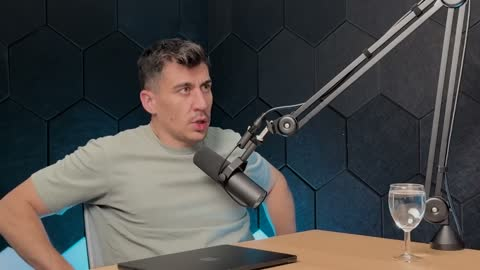
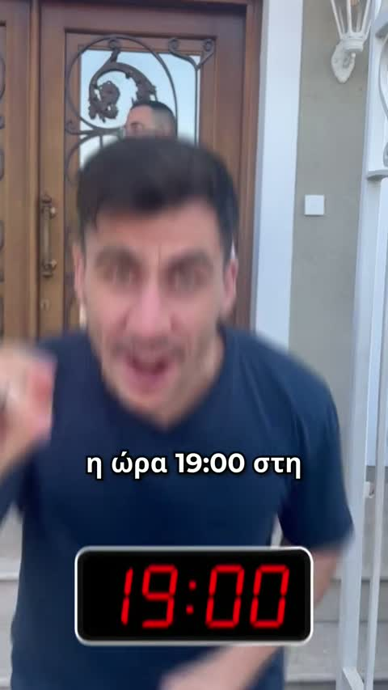

# 🎙️ Fidias Test — Multi-Language Dubs

Voice-cloned dubs (Zero-shot voice cloning via **OmniVoice** & **MOSS TTS**) for two source videos.
Click any poster to play the video.

## 📺 1. Podcast clip (6:50–8:00) — 2 voices (Fidias + guest)

| 🇪🇸 Spanish | 🇷🇺 Russian |
|---|---|
| *OmniVoice* | *OmniVoice* |
|  |  |

| 🇪🇸 Spanish | 🇷🇺 Russian |
|---|---|
| *MOSS TTS* | *MOSS TTS* |
|  |  |

## 📺 2. Greek short — "Μπεπ, την ώρα έφτας στη Λευκοσία..." (Fidias voice, 7 languages)

| 🇬🇧 English | 🇫🇷 French | 🇮🇹 Italian | 🇪🇸 Spanish |
|---|---|---|---|
|  |  |  |  |

| 🇩🇪 German | 🇯🇵 Japanese | 🇨🇳 Chinese |
|---|---|---|
|  |  |  |

## 🗣️ Voice reference

`fidias_voice_ref_best.wav` — clean Greek (Cypriot) Fidias voice sample used for the clones.